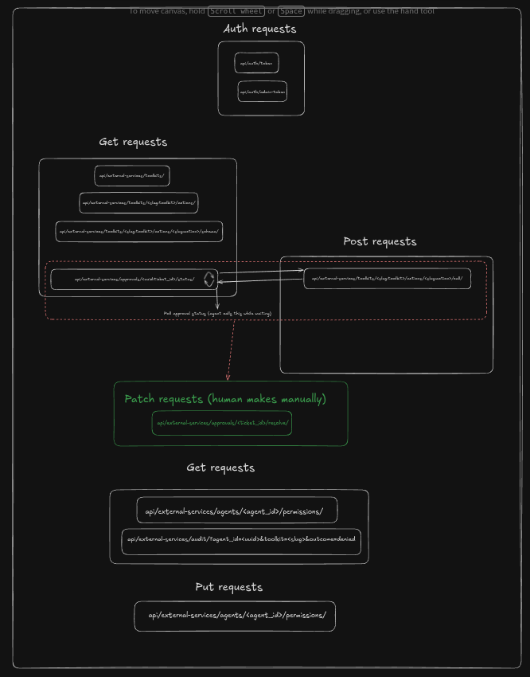

# Crator Assignment - Permissions & Audit Gateway

A single HTTP boundary that sits between AI agents and the external services they call. Every action is **authenticated**, **resolved against a permission policy**, **logged**, and (when sensitive) **gated by human approval**.

---

## Architecture



The diagram is the entire API surface, grouped by what each endpoint *does* rather than by HTTP verb alone. Five regions, each with a distinct job in the request lifecycle.

---

## Setting up locally

Two processes: Django gateway (`backend/`) and CLI agent (`agent/`). Run them in separate shells.

### Backend

```bash
cd backend
python -m venv .venv && source .venv/bin/activate
pip install -r requirements.txt
cp .env.example .env          # set NOTION_TOKEN, rotate secrets
python manage.py migrate
python manage.py createsuperuser
python manage.py register_notion_mcp        # registers Notion toolkit + demo agent, prints AGENT_ID
python manage.py runserver
```

Note the `AGENT_ID` printed by `register_notion_mcp` - the agent needs it.

### Agent

```bash
cd agent
python -m venv .venv && source .venv/bin/activate
pip install -r requirements.txt
cp .env.example .env          # populate ANTHROPIC_API_KEY, AGENT_ID, NOTION_PAGE_ID, NOTION_BLOCK_ID
python cli.py                 # runs default end-to-end demo
python cli.py "your prompt"   # or pass a custom prompt
```

Populate every value in `agent/.env` before running. `GATEWAY_URL` defaults to `http://localhost:8000`.

---

## How the pieces fit

Agent mints JWT → hits `/call/` → resolver branches on permission: `always_allow` runs executor (200), `requires_approval` creates ticket (202, agent polls `/status/`), `always_deny` short-circuits (403). Human resolves via `PATCH /resolve/`. Every branch writes one `AuditLog` row.

Invariants:
1. No action runs without `resolve()`.
2. No attempt goes unaudited (append-only, survives agent deletion via `agent_uuid` snapshot).
3. Agents cannot self-escalate - `PermissionOverride` writes require `kind=admin`.

## Data model

`Agent` (UUID) → `PermissionOverride` (sparse, deviations only) → `Action` (in `Toolkit`, with schemas + `default_permission`). `ApprovalTicket` holds gated-call state. `AuditLog` is immutable - FK + snapshot columns so rows survive deletes.

## Why this shape

Permissions layer only works if every external call goes through it. `/call/` is the sole executor path; `resolve()` and `AuditLog.create()` are unskippable. The diagram documents a chokepoint, not an API.

---

## Request reference

### 1. Auth requests - bootstrap identity

```
POST /api/auth/token/         -> agent JWT  (kind=agent)
POST /api/auth/admin-token/   -> admin JWT  (kind=admin)
```

Two token kinds, two different blast radii.

- **Agent token** - minted from an agent UUID. Carries `kind=agent`, expires in 20 minutes, and is what the CLI agent sends on every downstream call. Bootstrap endpoint: no auth required (you can't auth before you have a token).
- **Admin token** - minted from a Django session/basic-auth admin user, also `kind=admin`, also 20-minute TTL. Used by the admin to write per-agent permission overrides via the JWT pipeline without exposing that write to any agent.

The `kind` claim is what stops a held agent token from being replayed against an admin endpoint and vice versa. `JWTAuthentication` rejects `kind=admin`; `AdminJWTAuthentication` rejects everything else.

---

### 2. Get requests - discovery (top group)

```
GET /api/external-services/toolkits/
GET /api/external-services/toolkits/<toolkit>/actions/
GET /api/external-services/toolkits/<toolkit>/actions/<action>/schema/
GET /api/external-services/approvals/<ticket_id>/status/
```

Read-only catalog. The agent walks down: list toolkits -> list actions in a toolkit -> fetch the action's input/output JSON schema -> ready to call. Each `action` carries its **resolved permission for this agent** (override > default), so the agent knows up front whether the call will be allowed, gated, or denied.

`approvals/<ticket_id>/status/` belongs in this group too - it's the agent's polling endpoint when a previous call landed in `requires_approval` and is now waiting on a human.

---

### 3. Post requests - execute

```
POST /api/external-services/toolkits/<toolkit>/actions/<action>/call/
```

The single execution funnel. Every `call/` runs through the same pipeline:

```
JWT validate -> resolve(agent, action) -> branch on permission
                                          │
            ┌─────────────────────────────┼──────────────────────────┐
            ▼                             ▼                          ▼
       always_allow                requires_approval             always_deny
       run executor                create ApprovalTicket         skip executor
       audit "allowed"             audit "pending"               audit "denied"
       200 executed                202 pending_approval           403 denied
```

**Every branch writes one audit row.** The audit log is the only durable record that an attempt was made - even denials get written, because "agent X tried to delete page Y" is exactly the kind of event you want a record of.

The dashed red box in the diagram links `call/` to `approvals/status/`: that's the **polling loop**. Agent calls a `requires_approval` action -> gets `202 + ticket_id` -> polls `/status/` until it sees `approved` / `rejected` / `expired`.

---

### 4. Patch requests - human-in-the-loop resolution

```
PATCH /api/external-services/approvals/<ticket_id>/resolve/
```

The only endpoint a human touches. **No JWT** - gated by Django admin auth (session/basic + `IsAdminUser`), because the spec explicitly says approvals are a human concern outside the agent's token universe.

On `approved`: the executor actually runs, the result is stored on the ticket, status flips to `approved`, and an audit row is written. The agent's next `/status/` poll returns the result.

On `rejected`: status flips, the rejection reason is recorded, audit row written. Agent's poll returns the reason and stops.

There is **no path** by which the agent can transition a ticket from `pending` to `approved`. The state machine is closed from the agent side.

---

### 5. Get requests - introspection (bottom group)

```
GET /api/external-services/agents/<agent_id>/permissions/
GET /api/external-services/audit/?agent_id=<uuid>&toolkit=<slug>&outcome=denied
```

The "show me what's going on" endpoints.

- `/permissions/` - agent reads its own sparse overrides. The endpoint enforces `current_agent.id == agent_id` so one agent cannot inspect another's policy.
- `/audit/` - filterable view of the append-only audit log. The `agent_id` filter matches on the **immutable `agent_uuid` snapshot column**, not the FK. That's deliberate: deleting an agent nulls the FK (`on_delete=SET_NULL`) but leaves `agent_uuid` intact, so historical attribution survives.

---

### 6. Put requests - write policy

```
PUT /api/external-services/agents/<agent_id>/permissions/
```

The one write endpoint that requires an **admin JWT** (`kind=admin`), not an agent JWT. This is the self-escalation gate: without the kind split, any agent with a valid token could `PUT` itself to `always_allow` on a `delete` action.

The write is **sparse** - if the requested permission equals the action's `default_permission`, any existing override row is deleted instead of upserted. The DB only stores deviations from default. Resolution stays cheap: `override > default`.
